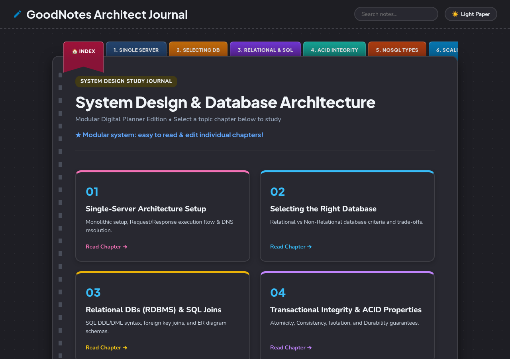

<div align="center">

# System Design & Database Architecture Journal
*A modular digital notebook for system design fundamentals, database architecture, and network protocols.*

<br/>

[](https://system-design-notes-wheat.vercel.app?_vercel_share=rtkI8vJzXZhV5TI0vcwLX7BryIQ5Foib)
[](https://astro.build/)
[](https://www.typescriptlang.org/)

<br/><br/>

<a href="https://system-design-notes-l362awb0x-auysh8s-projects.vercel.app/">
  
</a>

</div>

---

## Overview

A curated study journal covering distributed systems, database scaling, and communication protocols. Built with Astro 5 and MDX, featuring modular chapters, interactive light and dark paper themes, and real-time search.

---

## Live Demo

Access the live interactive journal: **[https://system-design-notes-wheat.vercel.app/?_vercel_share=rtkI8vJzXZhV5TI0vcwLX7BryIQ5Foib](https://system-design-notes-wheat.vercel.app/?_vercel_share=rtkI8vJzXZhV5TI0vcwLX7BryIQ5Foib)**

---

## Chapters

| Chapter | Title | Topics & Core Concepts | Link |
|:---:|:---|:---|:---:|
| 01 | [Single-Server Architecture](https://system-design-notes-l362awb0x-auysh8s-projects.vercel.app/notes/01-single-server/) | Monolithic setup, request/response lifecycle, DNS resolution | [Read](https://system-design-notes-l362awb0x-auysh8s-projects.vercel.app/notes/01-single-server/) |
| 02 | [Selecting the Right Database](https://system-design-notes-l362awb0x-auysh8s-projects.vercel.app/notes/02-selecting-db/) | Relational (SQL) vs. Non-Relational (NoSQL) trade-offs | [Read](https://system-design-notes-l362awb0x-auysh8s-projects.vercel.app/notes/02-selecting-db/) |
| 03 | [Relational DBs & SQL Joins](https://system-design-notes-l362awb0x-auysh8s-projects.vercel.app/notes/03-relational-sql/) | Schemas, DDL/DML, foreign key joins, ER diagrams | [Read](https://system-design-notes-l362awb0x-auysh8s-projects.vercel.app/notes/03-relational-sql/) |
| 04 | [ACID Transactional Integrity](https://system-design-notes-l362awb0x-auysh8s-projects.vercel.app/notes/04-acid-integrity/) | Atomicity, Consistency, Isolation, and Durability | [Read](https://system-design-notes-l362awb0x-auysh8s-projects.vercel.app/notes/04-acid-integrity/) |
| 05 | [NoSQL Classifications](https://system-design-notes-l362awb0x-auysh8s-projects.vercel.app/notes/05-nosql-types/) | Document, Wide-Column, Graph, and Key-Value stores | [Read](https://system-design-notes-l362awb0x-auysh8s-projects.vercel.app/notes/05-nosql-types/) |
| 06 | [System Scaling Strategies](https://system-design-notes-l362awb0x-auysh8s-projects.vercel.app/notes/06-scaling-guide/) | Vertical Scaling vs. Horizontal Scaling and stateless tiers | [Read](https://system-design-notes-l362awb0x-auysh8s-projects.vercel.app/notes/06-scaling-guide/) |
| 07 | [Load Balancing & Routing](https://system-design-notes-l362awb0x-auysh8s-projects.vercel.app/notes/07-load-balancing/) | 7 traffic routing algorithms, Consistent Hashing, health checks | [Read](https://system-design-notes-l362awb0x-auysh8s-projects.vercel.app/notes/07-load-balancing/) |
| 08 | [SPOF & High Availability](https://system-design-notes-l362awb0x-auysh8s-projects.vercel.app/notes/08-spof-resilience/) | Redundancy, failover strategies, and self-healing clusters | [Read](https://system-design-notes-l362awb0x-auysh8s-projects.vercel.app/notes/08-spof-resilience/) |
| 09 | [API Design & Protocols](https://system-design-notes-l362awb0x-auysh8s-projects.vercel.app/notes/09-api-design/) | HTTP/HTTPS internals, REST, GraphQL, gRPC, design principles | [Read](https://system-design-notes-l362awb0x-auysh8s-projects.vercel.app/notes/09-api-design/) |
| 10 | [Communication Protocols](https://system-design-notes-l362awb0x-auysh8s-projects.vercel.app/notes/10-communication-protocols/) | HTTP Polling, WebSockets, gRPC Streaming, AMQP brokers | [Read](https://system-design-notes-l362awb0x-auysh8s-projects.vercel.app/notes/10-communication-protocols/) |
| 11 | [Transport Layer: TCP & UDP](https://system-design-notes-l362awb0x-auysh8s-projects.vercel.app/notes/11-transport-layer-tcp-udp/) | Reliability vs. speed, 3-way handshake, packet loss recovery, protocol selection | [Read](https://system-design-notes-l362awb0x-auysh8s-projects.vercel.app/notes/11-transport-layer-tcp-udp/) |
| 12 | [RESTful API Design & Best Practices](https://system-design-notes-l362awb0x-auysh8s-projects.vercel.app/notes/12-restful-api-resource-modeling/) | Resource modeling, query filtering/sorting/pagination, HTTP methods idempotency, status codes, best practices | [Read](https://system-design-notes-l362awb0x-auysh8s-projects.vercel.app/notes/12-restful-api-resource-modeling/) |
| 13 | [GraphQL API Architecture](https://system-design-notes-l362awb0x-auysh8s-projects.vercel.app/notes/13-graphql-api-architecture/) | Why GraphQL exists, single endpoint querying, SDL type systems, queries, mutations, 200 OK errors | [Read](https://system-design-notes-l362awb0x-auysh8s-projects.vercel.app/notes/13-graphql-api-architecture/) |
| 14 | [Authentication Protocols](https://system-design-notes-l362awb0x-auysh8s-projects.vercel.app/notes/14-authentication-basic-digest-api-keys/) | Authn vs Authz, 5 dev confusions, HTTP Basic vs Digest flows, API Key architecture | [Read](https://system-design-notes-l362awb0x-auysh8s-projects.vercel.app/notes/14-authentication-basic-digest-api-keys/) |
| 15 | [Sessions, JWT & OAuth 2](https://system-design-notes-l362awb0x-auysh8s-projects.vercel.app/notes/15-session-jwt-tokens-oauth2/) | Stateful sessions, stateless JWTs, access/refresh token lifecycles, OAuth 2 code flow | [Read](https://system-design-notes-l362awb0x-auysh8s-projects.vercel.app/notes/15-session-jwt-tokens-oauth2/) |

---

## Features

- Digital notebook aesthetic with warm cream and dark paper themes.
- Type-safe content collections powered by Astro 5 and MDX.
- Real-time client-side search filtering across chapters and topics.
- One-click copy for code blocks and snippets.
- Fully responsive across desktop, tablet, and mobile displays.

---

## Getting Started

```bash
# Clone the repository
git clone https://github.com/auysh8/System-design-notes.git
cd System-design-notes

# Install dependencies
npm install

# Run the development server
npm run dev
```

Open `http://localhost:4321` in your browser.

---

## License

MIT
